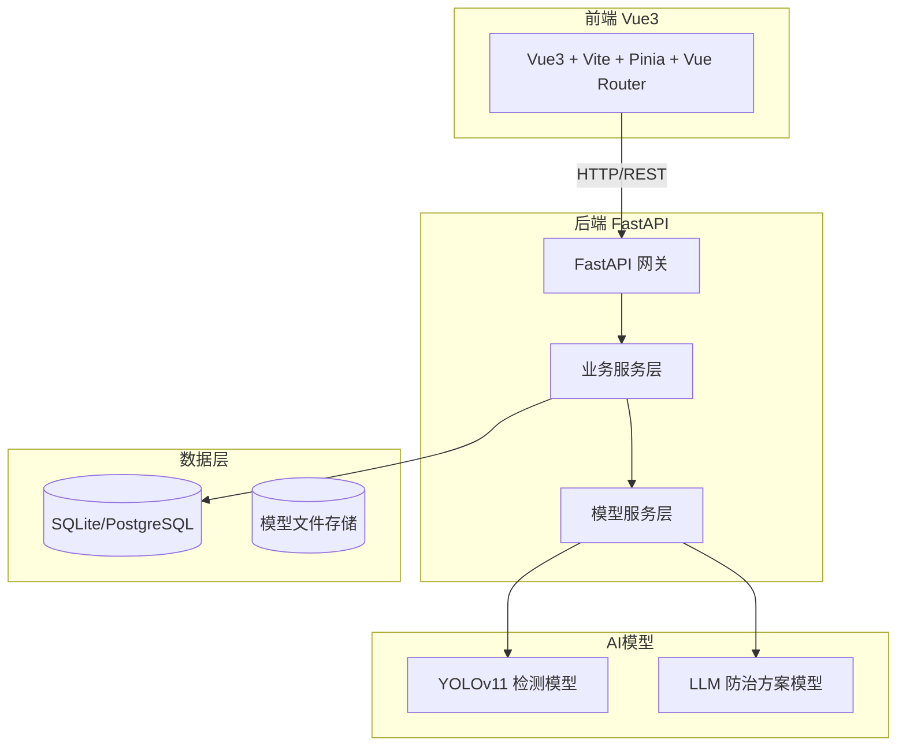
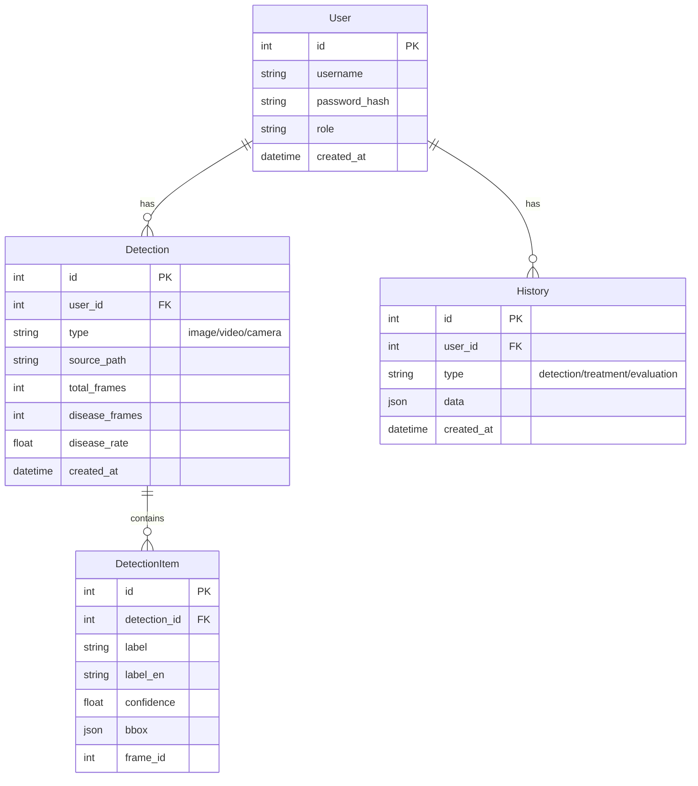
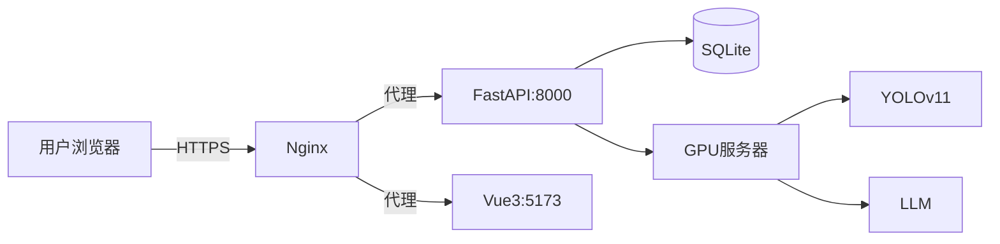

# 智慧农害系统 技术架构文档

## 1. 架构设计



## 2. 技术栈

### 2.1 前端

- **框架**：Vue3@3.4 + Composition API
- **构建工具**：Vite@5
- **状态管理**：Pinia
- **路由**：Vue Router@4
- **UI组件**：自定义组件 + TailwindCSS
- **图表**：ECharts@5
- **HTTP客户端**：Axios

### 2.2 后端

- **框架**：FastAPI@0.109
- **Python版本**：Python@3.10+
- **数据库**：SQLite（开发）/ PostgreSQL（生产）
- **ORM**：SQLAlchemy@2.0
- **深度学习**：PyTorch@2.0 + Ultralytics YOLOv11
- **LLM**：Transformers + PEFT (LoRA)
- **WebSocket**：支持实时摄像头流

### 2.3 模型

- **目标检测**：YOLOv11（Ultralytics）
- **LLM**：ChatGLM3-6B / Qwen-7B + LoRA微调
- **时序预测**：LSTM / Prophet

## 3. 路由定义

### 3.1 前端路由

| 路由 | 页面 | 权限 |
|------|------|------|
| /login | 登录页 | 公开 |
| /register | 注册页 | 公开 |
| / | 首页看板 | 登录 |
| /detect/image | 图片检测 | 登录 |
| /detect/video | 视频检测 | 登录 |
| /detect/camera | 实时摄像头 | 登录 |
| /predict | 趋势预测 | 登录 |
| /treatment | 防治方案 | 登录 |
| /evaluation | 效果评估 | 登录 |
| /compare | 历史对比 | 登录 |
| /knowledge | 知识库 | 登录 |
| /profile | 个人中心 | 登录 |
| /admin | 管理员页 | 管理员 |

### 3.2 后端API

| 方法 | 路径 | 描述 |
|------|------|------|
| POST | /api/auth/login | 用户登录 |
| POST | /api/auth/register | 用户注册 |
| GET | /api/auth/me | 获取当前用户 |
| GET | /api/dashboard/stats | 获取统计数据 |
| POST | /api/detect/image | 图片检测 |
| POST | /api/detect/video | 视频检测 |
| WS | /ws/camera | 摄像头实时检测 |
| POST | /api/predict/trend | 趋势预测 |
| POST | /api/treatment/generate | 生成防治方案 |
| POST | /api/evaluation/compare | 效果评估对比 |
| GET | /api/history | 获取检测历史 |
| GET | /api/knowledge | 获取知识库 |
| PUT | /api/profile/password | 修改密码 |
| GET | /api/admin/users | 用户管理 |
| GET | /api/admin/logs | 日志查看 |

## 4. API详细设计

### 4.1 认证接口

```typescript
// 登录请求
interface LoginRequest {
    username: string;
    password: string;
}

// 登录响应
interface LoginResponse {
    token: string;
    user: {
        id: number;
        username: string;
        role: 'user' | 'admin';
    };
}
```

### 4.2 检测接口

```typescript
// 图片检测请求
interface ImageDetectRequest {
    image: File; // multipart/form-data
}

// 图片检测响应
interface ImageDetectResponse {
    image_id: string;
    detections: Array<{
        bbox: [number, number, number, number]; // x1,y1,x2,y2
        label: string;        // 中文标签
        label_en: string;     // 英文标签
        confidence: number;   // 0-1
    }>;
    result_image: string; // Base64 绘制了检测框的图片
    detection_time: number; // ms
}

// 视频检测响应
interface VideoDetectResponse {
    total_frames: number;
    disease_frames: number;
    disease_rate: number;
    categories: Array<{
        name: string;
        count: number;
        frame_count: number;
        percentage: number;
        avg_confidence: number;
    }>;
    top_frames: Array<{
        frame_id: number;
        label: string;
        confidence: number;
    }>;
}
```

### 4.3 防治方案接口

```typescript
// 防治方案请求
interface TreatmentRequest {
    disease_name: string;
    severity: 'light' | 'medium' | 'severe';
    crop_type: string;
}

// 防治方案响应
interface TreatmentResponse {
    disease: string;
    severity: string;
    recommendations: {
        pesticides: Array<{
            name: string;
            concentration: string;
            method: string;
        }>;
        farming_tips: string[];
        safety_interval: string; // 安全间隔期
    };
}
```

## 5. 数据模型

### 5.1 ER图



### 5.2 DDL

```sql
CREATE TABLE users (
    id INTEGER PRIMARY KEY AUTOINCREMENT,
    username VARCHAR(50) UNIQUE NOT NULL,
    password_hash VARCHAR(255) NOT NULL,
    role VARCHAR(20) DEFAULT 'user',
    created_at TIMESTAMP DEFAULT CURRENT_TIMESTAMP
);

CREATE TABLE detections (
    id INTEGER PRIMARY KEY AUTOINCREMENT,
    user_id INTEGER NOT NULL,
    type VARCHAR(20) NOT NULL,
    source_path VARCHAR(500),
    total_frames INTEGER,
    disease_frames INTEGER,
    disease_rate FLOAT,
    created_at TIMESTAMP DEFAULT CURRENT_TIMESTAMP,
    FOREIGN KEY (user_id) REFERENCES users(id)
);

CREATE TABLE detection_items (
    id INTEGER PRIMARY KEY AUTOINCREMENT,
    detection_id INTEGER NOT NULL,
    label VARCHAR(100),
    label_en VARCHAR(100),
    confidence FLOAT,
    bbox TEXT,
    frame_id INTEGER,
    FOREIGN KEY (detection_id) REFERENCES detections(id)
);

CREATE TABLE histories (
    id INTEGER PRIMARY KEY AUTOINCREMENT,
    user_id INTEGER NOT NULL,
    type VARCHAR(50) NOT NULL,
    data TEXT,
    created_at TIMESTAMP DEFAULT CURRENT_TIMESTAMP,
    FOREIGN KEY (user_id) REFERENCES users(id)
);

CREATE TABLE knowledge_base (
    id INTEGER PRIMARY KEY AUTOINCREMENT,
    disease_name VARCHAR(100),
    disease_name_en VARCHAR(100),
    crop_type VARCHAR(50),
    symptoms TEXT,
    prevention TEXT,
    treatment TEXT,
    image_path VARCHAR(500)
);

CREATE INDEX idx_detections_user ON detections(user_id);
CREATE INDEX idx_detections_created ON detections(created_at);
CREATE INDEX idx_detection_items_detection ON detection_items(detection_id);
```

## 6. 目录结构

```
PythonProject/
├── frontend/                 # Vue3前端
│   ├── src/
│   │   ├── api/              # API调用
│   │   ├── assets/           # 静态资源
│   │   ├── components/       # 公共组件
│   │   ├── layouts/          # 布局组件
│   │   ├── pages/            # 页面组件
│   │   ├── router/           # 路由配置
│   │   ├── stores/           # Pinia状态
│   │   ├── styles/           # 全局样式
│   │   ├── utils/            # 工具函数
│   │   ├── App.vue
│   │   └── main.js
│   ├── index.html
│   ├── vite.config.js
│   └── package.json
│
├── backend/                  # FastAPI后端
│   ├── app/
│   │   ├── api/              # API路由
│   │   ├── core/             # 核心配置
│   │   ├── models/           # 数据模型
│   │   ├── services/        # 业务逻辑
│   │   ├── ml/               # 机器学习模块
│   │   │   ├── detector.py   # YOLOv11检测
│   │   │   ├── predictor.py  # 趋势预测
│   │   │   └── llm.py        # LLM生成
│   │   ├── utils/            # 工具函数
│   │   ├── main.py
│   │   └── database.py
│   ├── models/               # 训练模型存储
│   ├── requirements.txt
│   └── run.py
│
├── .trae/
│   └── documents/
│       ├── PRD.md
│       └── ARCHITECTURE.md
│
└── 34fc0c042e2ab534a1ed9bc49089df78.jpg
```

## 7. 部署架构



开发环境：前后端分离，前端`vite dev`，后端`uvicorn`
生产环境：Nginx 反向代理，PM2/Gunicorn 管理进程
