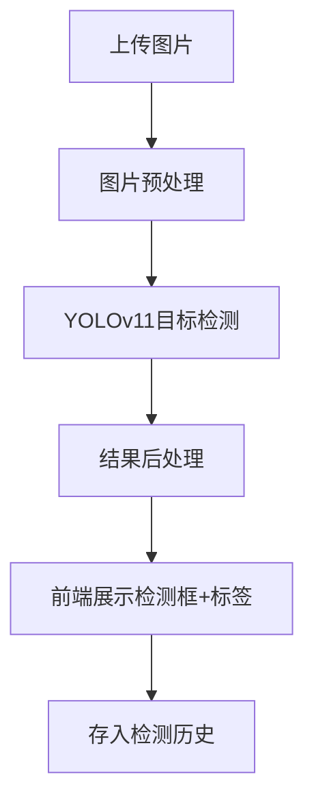
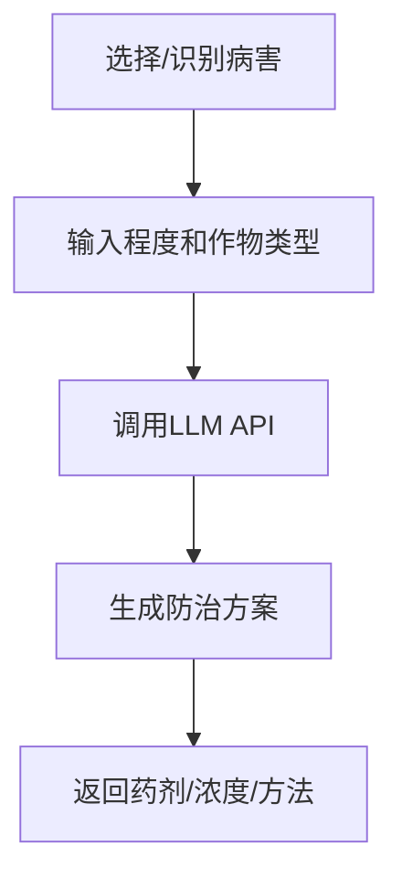

# 智慧农害——农作物病虫害检测与防治系统 PRD

## 1. 产品概述

智慧农害是一款基于人工智能的农作物病虫害检测与防治系统，集成YOLOv11目标检测模型与LLM大语言模型，为农户和农业技术人员提供智能化的病虫害识别、预测和防治方案。

**核心价值**：降低病虫害损失，提高农作物产量，保障农业安全生产。

**目标用户**：农户、农业技术人员、农技推广人员、农业合作社。

## 2. 功能模块

### 2.1 用户角色

| 角色 | 注册方式 | 核心权限 |
|------|----------|----------|
| 普通用户 | 用户名密码注册 | 图片/视频检测、查看防治方案、历史记录 |
| 管理员 | 系统初始化创建 | 用户管理、模型管理、日志查看、系统设置 |

### 2.2 功能架构

1. **首页数据看板** - 统计卡片、7日趋势图
2. **图片检测** - 单图上传、YOLOv11检测、结果展示
3. **视频检测** - 视频上传、帧级检测、统计报表
4. **实时摄像头检测** - 摄像头流处理、实时统计
5. **病虫害趋势预测** - 时间序列预测、未来7天趋势
6. **智能防治方案生成** - LLM生成防治建议
7. **防治效果评估** - 施药前后对比
8. **历史数据对比** - 多时间段数据对比分析
9. **知识库与社区** - 病虫害图文库、用户交流
10. **个人中心** - 密码修改、检测历史、通知设置
11. **管理员功能** - 用户管理、模型管理、日志查看

## 3. 核心流程

### 3.1 图片检测流程

### 3.2 防治方案生成流程

## 4. 视觉设计

### 4.1 设计风格

- **主题**：自然清新、农业科技感
- **主色调**：嫩绿色 `#C6F7D0` / `#A3E4A3`
- **强调色**：`#2D5016` 深绿色
- **背景色**：`#F5FBF5` 浅绿灰
- **文字色**：`#1A1A1A` 主文字 / `#666666` 次要文字
- **圆角**：12px 卡片圆角
- **阴影**：柔和投影 `0 4px 20px rgba(0,0,0,0.08)`

### 4.2 字体

- **标题**：Noto Sans SC Bold / 思源黑体
- **正文**：Noto Sans SC Regular
- **数字**：DIN Alternate / Roboto Mono

### 4.3 布局

- **整体**：侧边栏导航(240px) + 右侧内容区
- **侧边栏**：嫩绿色背景，白色图标，深色文字
- **内容区**：白色卡片式布局，内边距24px

### 4.4 登录页面

- 背景：指定 agricultural.jpg 农业背景图
- 居中白色半透明磨砂玻璃卡片
- 输入框：白色背景，圆角，深绿色边框
- 按钮：渐变绿色 `#A3E4A3` → `#2D5016`

## 5. 页面详细设计

### 5.1 首页数据看板

| 模块 | 元素 | 样式 |
|------|------|------|
| 欢迎区 | 欢迎语 + 当前时间 | 大标题，日期小字 |
| 统计卡片 x4 | 今日检测/检出率/Top1/模型状态 | 白色卡片，图标+数字 |
| 趋势图 | 近7天折线图 | 白色卡片，绿色线条 |

### 5.2 图片检测页

| 模块 | 元素 | 布局 |
|------|------|------|
| 上传区 | 拖拽框+按钮 | 居中，虚线边框 |
| 检测按钮 | 开始检测 | 绿色主按钮 |
| 结果展示 | 左侧原图/右侧检测图 | 左右两列 |
| 检测表格 | 类别/置信度/坐标 | 底部表格 |

### 5.3 视频检测页

| 模块 | 元素 |
|------|------|
| 视频上传 | MP4/AVI 支持 |
| 统计概览 | 总帧数/病害帧数/帧检测率 |
| 类别统计表 | 类别/出现次数/帧数/占比/平均置信度 |
| 前10帧详情 | 帧号/类别/置信度 |

### 5.4 实时摄像头页

| 模块 | 元素 |
|------|------|
| 视频区 | 本地摄像头实时流 |
| 实时统计 | FPS/已检测帧/病害帧/运行时间 |
| 检测记录 | 最近10次滚动列表 |

### 5.5 趋势预测页

| 模块 | 元素 |
|------|------|
| 输入区 | 作物类型下拉/起始日期选择 |
| 预测图 | 未来7天折线图 |
| 预测表 | 日期/病害概率/风险等级 |

### 5.6 防治方案生成页

| 模块 | 元素 |
|------|------|
| 输入区 | 病害选择/程度/作物类型 |
| 生成按钮 | 调用LLM |
| 方案展示 | 药剂/浓度/方法/农事建议/安全间隔期 |

### 5.7 防治效果评估页

| 模块 | 元素 |
|------|------|
| 图片上传 | 施药后图像 |
| 历史对比 | 上次检测 vs 本次检测 |
| 效果结论 | 数量变化/有效/一般/无效 |

### 5.8 历史对比页

| 模块 | 元素 |
|------|------|
| 时间选择 | 两个时间段选择器 |
| 对比图 | 柱状图 |
| 对比表 | 类别/数量/置信度变化 |

### 5.9 知识库页

| 模块 | 元素 |
|------|------|
| 搜索栏 | 关键词检索 |
| 知识卡片 | 病虫害图文展示 |
| 社区留言 | 用户提问列表 |

### 5.10 个人中心

| 模块 | 元素 |
|------|------|
| 密码修改 | 原密码/新密码/确认 |
| 历史记录 | 分页列表 |
| 通知设置 | 开关配置 |

### 5.11 管理员页

| 模块 | 元素 |
|------|------|
| 用户管理 | 增删改查表格 |
| 模型管理 | 版本列表 |
| 日志查看 | 分页日志 |

## 6. 技术要求

### 6.1 检测模型

- **模型**：YOLOv11
- **类别**：健康、潜叶病、锈病、白粉病、早疫病（至少5种）
- **输出**：边界框坐标、类别标签（中英文）、置信度

### 6.2 LLM模型

- **模型**：ChatGLM3-6B / Qwen-7B（LoRA微调）
- **领域**：农业病害知识
- **输出**：防治方案文本

### 6.3 响应式设计

- 桌面端优先（1200px+）
- 平板适配（768px-1199px）
- 移动端基础支持（<768px）
